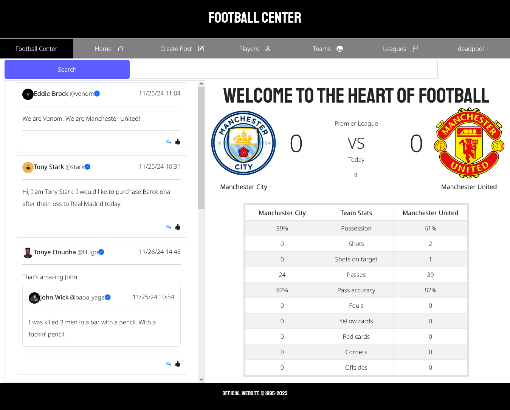

# Football Center ⚽

## Welcome! 👋

Thank you for checking out **Football Center**, a social web application designed for football enthusiasts.

## Screenshot 🖼️



## Table of Contents 📚

-   [Project Description](#project-description)
-   [Implementation Details](#implementation-details)
-   [Installation](#installation)
-   [Technologies](#technologies)
-   [Dependencies](#dependencies)
-   [Contributors](#contributors)
-   [Author](#author)

## Project Description 📝

Football Center is a web app built with the **Django web framework** that allows users to catch up on their favorite
teams and simulated matches. While the matches are not live, the platform creates an engaging experience similar to
following real-time games. It also enables seamless user interaction.

## Implementation Details 🛠️

### Step 1: Understanding the Idea 💡

The project’s aim is to create a platform for football fans to:

-   Stay updated on teams and match simulations
-   Connect and communicate with other users

### Step 2: Key Functionalities ⚙️

The application provides:

-   👤 Account creation with login/logout functionality
-   📝 Personal profile pages
-   ⚽ Simulated live match scores and statistics
-   🏆 Information on teams from Europe’s top 5 leagues
-   📰 Create, view, edit, and delete posts
-   💬 Reply to, quote, and interact with posts
-   🔔 Notifications for user interactions
-   🔍 User search functionality
-   ➕ Follow/unfollow users and view their profiles

### Step 3: Requirements Checklist 📋

-   Web framework for routing, authentication, and serialization
-   Database/DBMS for storing user and match data
-   APIs for search and follow features
-   Git for version control

### Step 4: Key Features Highlights ✨

-   Sports section with stats and updates
-   Rich profile management with biography and pictures
-   Chat functionality for communication
-   Real-time-like notifications
-   User discovery with search and follow options

## Installation (Django) 💻

**macOS/Linux:**

```sh
python -m pip install Django
```

**Windows:**

```sh
py -m pip install Django
```

## Technologies 🛠️

Football Center uses:

-   [Python](https://www.python.org/)
     – Programming
    language
-   [Django](https://www.djangoproject.com/) – Web framework
-   [Django REST Framework](https://www.django-rest-framework.org/) – API development
-   [React](https://react.dev/) – Frontend library
-   [PostgreSQL](https://www.postgresql.org/) – Database
-   **HTML & CSS** – Structure and styling

## Dependencies 📦

See **requirements.txt** for all project dependencies.

## Contributors 👥

-   Tonye Hugo Onuoha – [GitHub](https://github.com/Tonye-Onuoha)

## Author 👨‍💻

**Tonye Hugo Onuoha** Email: [tonyeonuoha@gmail.com](mailto:tonyeonuoha@gmail.com) Phone: +2349054466479
